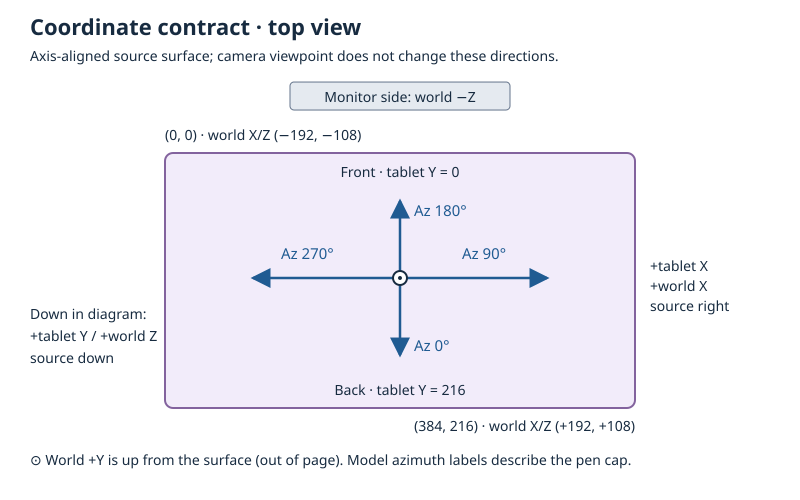

# Canonical coordinate and input contract

This is the source of truth for host adapters and future recorded-stroke imports. Existing teaching controls and rendering retain their current behavior. Portable math is in `math.js`; source conversion is in `input-coordinates.js`. Both are checked by `npm run check:math` without browser types.



## Model geometry and units

One world unit is one model millimetre. `TABLET` defines a 384 × 216 active area, a 25 mm margin on every side, and 5.28 mm thickness. The body is therefore 434 × 266 × 5.28; the sensing plane is at world Y = 2.64. `SCALE = 24` is a legacy artistic multiplier. Physical inch measurements convert with 25.4, exposed by `inchesToMillimetres`; a physical 16-inch width is 406.4 mm, not the model's 384 mm. These dimensions are illustrative, not a particular product's specifications.

Tablet X runs 0→384 left to right, tablet Y runs 0→216 from the model's front to back, and distance is height above the plane. World coordinates are `(tabletX − 192, 2.64 + distance, tabletY − 108)`, with Y up. The monitor is on negative Z at `MONITOR.z = -288`; increasing tablet Y moves away from that placement. Camera movement does not redefine these axes.

`tabletToWorld` and existing UI setters clamp pen position to the active area. Cursor mapping can place the reported cursor outside it. Positive edge strength repels, negative attracts; effects taper inward and do not capture an already-outside point. Opposite-edge effects add if their ranges overlap. Monitor mapping extrapolates rather than clamps, with tablet Y=0 at screen top. See [cursor stages](CURSOR_PIPELINE.md).

## Orientation and validity

The model's altitude is lean in degrees: 0 upright, 90 horizontal. Azimuth 0 leans toward +Z, 90 toward +X, 180 toward −Z, and 270 toward −X. Rotation is `Y(azimuth) * X(lean) * Y(barrel)`. Positive barrel follows the right-hand rule around the pen's local +Y axis, counterclockwise when viewed from cap toward tip. Device twist zero needs calibration to the model's marker.

The UI's 0–60 degree lean range is a teaching constraint, not a recording validity constraint. The adapters accept valid orientations up to 90 without clamping. Hosts must not pass an 80-degree recording through a setter that silently clips it to 60. Horizontal orientation is valid for `penTransform`, but the existing tangent-based `planarTilt`/compensation pipeline does not support exactly 90; playback must handle that explicitly before using the current facade.

All supplied numbers must be finite. Missing pairs return null; incomplete pairs or out-of-range values throw `RangeError`. An upright orientation returns `{ altitude: 0, azimuth: null }`: direction is undefined, not measured zero. A renderer may retain its previous azimuth for upright continuity. Ambiguous horizontal tilt pairs also return null azimuth, but a renderer must flag or skip their unknown direction rather than invent it.

## Pointer Events adapters

[Pointer Events Level 3](https://www.w3.org/TR/pointerevents3/#pointerevent-interface) defines surface-relative altitude in radians, azimuth from screen +X increasing toward screen +Y, planar tilts in degrees, and clockwise twist. Under this app's explicit alignment (source +X → tablet +X; source +Y → tablet +Y), conversion is:

```text
model lean    = 90 − altitudeAngle × 180/π
model azimuth = wrap360(90 − azimuthAngle × 180/π)
model barrel  = wrap360(calibratedZero − twist)
```

Choose `pointerAnglesToOrientation` for spherical samples or `pointerTiltToOrientation` for planar samples. Selection is explicit: do not combine conflicting sets or prefer spherical fields merely because a browser provides them. Browser defaults cannot distinguish unavailable sensors from real upright/zero measurements. A host with capability metadata should omit unavailable values. `pointerTwistToBarrel(twist, calibratedZero)` likewise returns null for missing twist.

For planar conversion, signed tangents reconstruct the lean direction. A horizontal cardinal pair (such as 90,0) identifies its direction. Other pairs containing ±90 lose direction information; this adapter preserves null rather than presenting the standard's fallback angle as measured data. Browser integer tilt quantization also limits round-trip precision.

No Pointer Events hover height is inferred, and pressure is not converted into distance. These functions add no live device listeners or replay UI. Device calibration, timestamps, pressure, coalesced samples, capability metadata, and file formats remain host/recording responsibilities.

## Position adapter

`clientToTablet(sample, rect, tablet)` maps an axis-aligned input rectangle in CSS pixels to active-area model millimetres. It uses fractions `(clientX−left)/width` and `(clientY−top)/height`, without device-pixel-ratio multiplication or physical display-DPI assumptions. Out-of-bounds samples retain their coordinates and return `inside: false`. The importer must explicitly choose reject, preserve, or clamp before applying a pose.

Supply the capture surface's content rectangle in the same coordinate frame as the samples, not the bounding box of the perspective 3D viewer. Rotated, skewed, mirrored, or perspective-transformed capture surfaces require a separate transform. Anisotropic capture scaling changes position fractions only; it must not distort measured orientation.

## Reference cases and usage

`test/input-coordinates.test.js` contains cardinal, corner, boundary, missing-value, and unit fixtures. Source spherical directions right/down/left/up map to model azimuth 90/0/270/180. Source altitude π/2 becomes upright; 0 becomes horizontal. Source twist 90 with zero calibration becomes model barrel 270. A 768 × 432 CSS-pixel rectangle beginning at (10,20) maps its center (394,236) to tablet (192,108); a sample at (8,454) remains outside at approximately (-1,217).

```js
import { pointerAnglesToOrientation, pointerTwistToBarrel, clientToTablet }
  from './src/lib/sim/input-coordinates.js';

const orientation = pointerAnglesToOrientation({
  altitudeAngle: Math.PI / 4, azimuthAngle: 0,
}); // { altitude: 45, azimuth: 90 }
const barrel = pointerTwistToBarrel(90, 0); // 270; explicit device-zero calibration
const point = clientToTablet({ clientX: 394, clientY: 236 },
  { left: 10, top: 20, width: 768, height: 432 }, { width: 384, depth: 216 });
// { tabletX: 192, tabletY: 108, inside: true }
```

The existing fixed reference fixtures continue to test unchanged renderer behavior. These adapters establish coordinate semantics; they make no hardware-driver accuracy claim.
