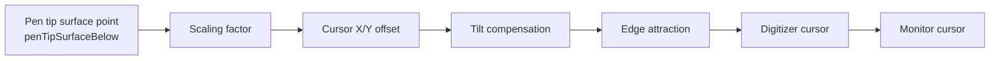

# WebDrawTabSim — Cursor pipeline

How the digitizer (and monitor) cursor position is computed from pen pose and pointer-tracking settings.

Implemented in `updateCursorFromPen()` in `src/lib/sim/pen-pen.js`. Defaults and scales live in `src/lib/sim/config.js` (`POINTER_DEFAULTS`).

## Pipeline



All intermediate results are in **world** XZ on the tablet surface (inches). Tablet-direction offsets map as: tablet X → world X, tablet Y → world Z.

## Stages

### 1. Tip projection

Start from the world point directly below the pen tip on the digitizer plane (`penTipSurfaceBelow`).

### 2. Scaling factor

```
if scalingFactor > 0:
  cursorXZ = tipXZ × scalingFactor
else:
  cursorXZ = (0, 0)   # origin; offsets/compensation still apply
```

`scalingFactor = 1` leaves the tip projection unchanged. Values other than 1 expand/contract the cursor’s travel relative to tablet center (world origin on the digitizer).

### 3. Cursor offset

Add constant `cursorOffsetX` / `cursorOffsetY` (inches).

### 4. Tilt compensation

Uses derived **Tilt X** / **Tilt Y** (degrees). Separate gains for positive and negative lean on each axis:

```
scale = tiltCompensationScale   # default 0.01 in per degree at gain 1.0

if tiltX > 0:  worldCompX = tiltX × posTiltXGain × scale
if tiltX < 0:  worldCompX = tiltX × negTiltXGain × scale
# same pattern for tiltY → worldCompZ
```

This models drivers that shift the reported cursor when the pen is tilted (parallax / contact-point heuristics).

### 5. Edge attraction

If `edgeAttraction ≠ 0` and the cursor is within `edgeAttractionRange` of a digitizer edge:

- Strength ramps from 0 at the range boundary to full at the edge.
- **Positive** attraction pushes the cursor **away** from the nearest edge.
- **Negative** pulls toward the edge.

Applied independently on left/right (world X) and front/back (world Z).

### 6. Place cursors

- Digitizer arrow at `(worldCursorX, yOffset [+ small lift], worldCursorZ)`.
- In **pen display** mode the arrow is raised slightly above the embedded screen.
- `updateMonitorCursor(worldCursorX, worldCursorZ)` mirrors the same logical position onto the external monitor (hidden in pen display mode).

## Monitor mapping

Digitizer world coords → normalized `[-1, 1]` → screen face:

```
normalizedX = worldCursorX / (tabletWidth  / 2)
normalizedZ = worldCursorZ / (tabletDepth  / 2)

screenCursorX = normalizedX × (screenWidth  / 2)
screenCursorY = monitorBodyCenterY − normalizedZ × (screenHeight / 2)
```

With the current formula, **front** of the tablet (negative world Z) maps toward the **top** of the screen face, and **back** toward the **bottom**. Both cursors share visibility via `setCursorVisible()` (monitor cursor also respects pen-display mode).

## Teaching tip

Leave pointer-tracking at defaults to show “cursor under tip.” Then change one stage at a time (offset → compensation → scaling → edge) so students see each driver behavior in isolation. Turn on the tablet checkerboard annotation to measure shifts in inches.
